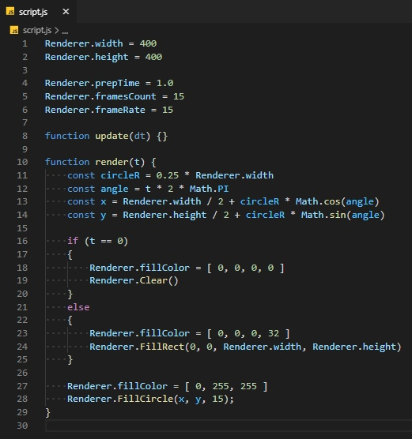
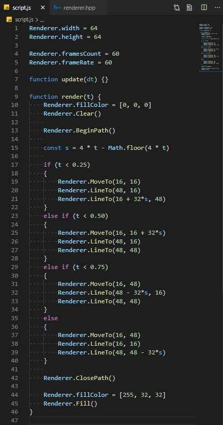
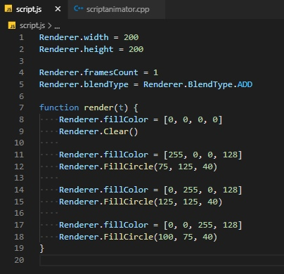
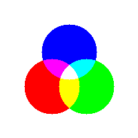

# GifMaker

## Examples

|  |  |
| - | - |
|  |  |
|  |  |

---

## Usage

1. Write js script using API from examples
2. Rebuild project with command `make` (or build in other way if you are using different building system)
3. Run `GifMaker.exe <your-js-script-name>`
4. Wait for output `out.gif`

---

## Requirements

0. Linux (for system calls (might be better to switch to cross platform solution))
2. make + g++ **OR** premake5 + whatever you like for building project
3. [imagemagick](https://imagemagick.org/index.php)

---

## P.S.

Feel free to make issues and contribute too!
